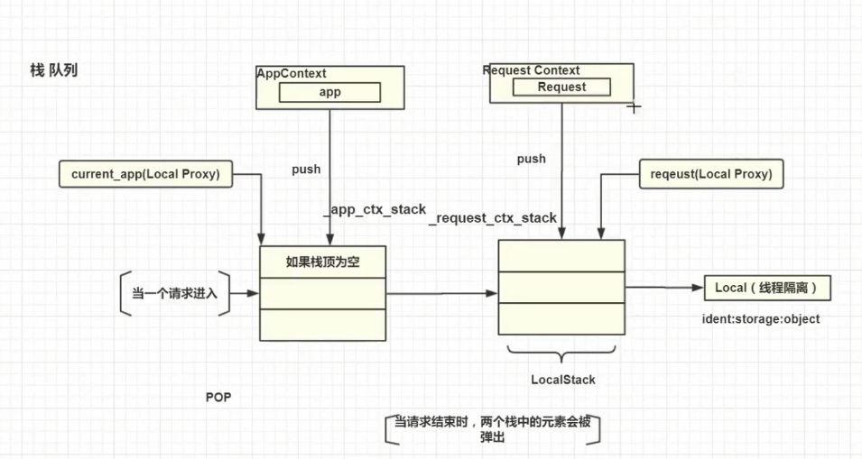
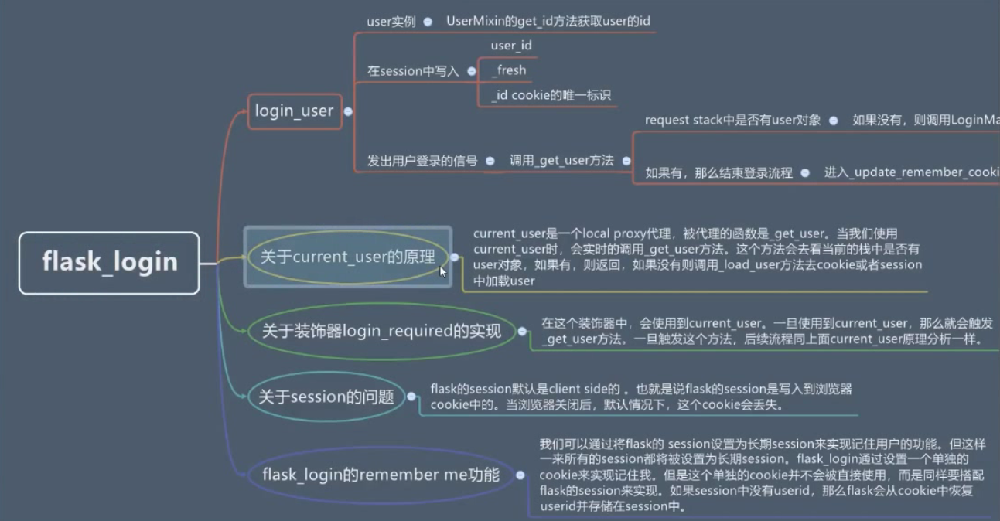

## v4

- 一个蓝图多个模块(book,user...)

```python
# app/web/__init__.py
from flask import Blueprint
web = Blueprint('web', __name__)
from app.web import book
from app.web import user

# app/web/book.py
from . import web
@web.route('/user')
def login():
    return 'success.'

# app/web/user.py
@web.route('/user')
def login():
    return 'success.'
```

- 注册蓝图

```python
# app/__init__.py
def create_app():
    app = Flask(__name__)
    app.config.from_object('config')
    register_buleprint(app)
    return app

def register_buleprint(app):
    from app.web import web
    app.register_blueprint(web)
    
```

##  v4 

- 表单和验证

```python
# app/forms/book.py
from wtforms import Form, StringField, IntegerField
from wtforms.validators import Length, NumberRange, DataRequired

class SearchForm(Form):
    q = StringField(validators=[DataRequired(), Length(min=1, max=30)])
    page = IntegerField(validators=[NumberRange(min=1, max=99)], default=1)

# app/web/book.py
form = SearchForm(request.args)
print(form.errors)
```

## v4 

- 定义书籍模型类

```python
# app/models/book.py
from flask_sqlalchemy import SQLAlchemy
from sqlalchemy import Column,Integer,String

db = SQLAlchemy()

class Book(db.Model):
    __tablename__ = 'book'
    id = Column(Integer, primary_key=True, autoincrement=True)
    title = Column(String(50), nullable=False)
    _author = Column('author', String(30), default='未名')
    binding = Column(String(20))
```

```python
# app/__init__.py
from app.models.book import db

def create_app():
    app = Flask(__name__)
    app.config.from_object('app.setting')
    app.config.from_object('app.secure')

    # 启用flask-SQLAlchemy插件,初始化并创建表
    db.init_app(app)
    db.create_all(app=app)
    return app
```

---

## v5 

- 使用with来实现上下文

```python
# 实现了上下文协议的对象使用with
# 上下文管理器
with app.app_context():
    a = current_app
    d = current_app.config['DEBUG']
    print(a, d)
```

---

## v6 

- 线程隔离的werkzeug.local.Local

```python
import threading
import time
from werkzeug.local import Local

my_obj = Local()
my_obj.b = 1

def worker():
    my_obj.b = 2
    print('in new thread b is: {}'.format(my_obj.b))

new_t = threading.Thread(target=worker, name='qiyue_thread')
new_t.start()
time.sleep(1)

# 主线程
print('in main thread b is: {}'.format(my_obj.b))

# 输出
in new thread b is: 2
in main thread b is: 1
```

- 线程隔离的werkzeug.local.LocalStack

```python
import threading
import time

from werkzeug.local import LocalStack

my_stack = LocalStack()
my_stack.push(1)
print('in main thread after push, value is: {}'.format(my_stack.top))

def worker():
    print('in new thread before push, value is: {}'.format(my_stack.top))
    my_stack.push(2)
    print('in new thread after push, value is: {}'.format(my_stack.top))

new_t = threading.Thread(target=worker, name='qiyue-thread')
new_t.start()
time.sleep(1)
# 主线程
print('finally, in main thread value is: {}'.format(my_stack.top))

# 输出
in main thread after push, value is: 1
in new thread before push, value is: None
in new thread after push, value is: 2
finally, in main thread value is: 1

```

- 以线程ID号作为key的字典 -> Local -> LocalStack

- AppContext RequestContext -> localStack

- Flask -> AppContext     Request -> RequestContext

- current_app -> (LocalStack.top == AppContext top.app == Flask)

- request -> (LocalStack.top == RequestContext top.request == Request)

- 启动多线程:

```python
# 程序入口 fisher.py
from app import create_app

app = create_app()

if __name__ == '__main__':
    app.run(host='127.0.0.1', port=5000, threaded=True, debug=app.config['DEBUG'])
```



---

## v7 

- 重构鱼书YuShuBook

```python
# app/spider/yush_book.py
class YuShuBook:
    isbn_url = 'http://t.yushu.im/v2/book/isbn/{}'
    keyword_url = 'http://t.yushu.im/v2/book/search?q={}&count={}&start={}'

    def __init__(self):
        self.total = 0
        self.books = []

    def search_by_isbn(self, isbn):
        url = self.isbn_url.format(isbn)
        result = HTTP.get(url)
        self.__fill_single(result)

    def __fill_single(self, data):
        if data:
            self.total = 1
            self.books.append(data)

    def search_by_keyword(self, keyword, page=1):
        # 处理分页转换(每页数count，每页开始索引start)
        size = current_app.config['PRE_PAGE']
        url = self.keyword_url.format(keyword, size, (page - 1) * size)
        # url = self.keyword_url.format(keyword, current_app.config['PRE_PAGE'], self.calc_start(page))
        result = HTTP.get(url)
        self.__fill_collection(result)

    def __fill_collection(self, data):
        self.total = data['total']
        self.books = data['books']

    # def calc_start(self, page):
    #     return (page - 1) * current_app.config['PRE_PAGE']

```

- 面向对象方式构造Book view_model类

```python
# app/view_models/book.py

# 定义BookViewModel
class BookViewModel:
    def __init__(self, book):
        self.title = book['title']
        self.publisher = book['publisher']
        self.pages = book['pages'] or ''
        self.author = '、'.join(book['author'])
        self.price = book['price']
        self.summary = book['summary'] or ''
        self.image = book['image']

# 定义BookCollection
class BookCollection:
    def __init__(self):
        self.total = 0
        self.books = []
        self.keyword = ''

    def fill(self, yushu_book, keyword):
        self.total = yushu_book.total
        self.keyword = keyword
        self.books = [BookViewModel(book) for book in yushu_book.books]
```

- 搜索书籍的视图函数

```python
# app/web/book.py
books = BookCollection()
yushu_book = YuShuBook()
if isbn_or_key == 'isbn':
    yushu_book.search_by_isbn(q)
else:
    yushu_book.search_by_keyword(q, page)
books.fill(yushu_book, q)
```

- 对象的序列化

```python
# 多层嵌套对象的处理
# [<class Book {}>,<class Book {}>,<class Book {}>]
json.dumps(books, default=lambda o: o.__dict__)
```

---

## v8 
- 定义静态文件的目录
- 定义模版文件的目录
- send_static_file区分下载权限的文件

---

## v9

- BookViewModel合并多个属性(书籍简介)

```python
@property
def intro(self):
    intros = filter(lambda x: True if x else False,
                    [self.author, self.publisher, self.price])
    return '/'.join(intros)
```

- YuShuBook添加返回第1本书籍

```python
@property
def first(self):
    return self.books[0] if self.total > 0 else None
```

- 书籍详情

```python
@web.route('/book/<isbn>/detail')
def book_detail(isbn):
    yushu_book = YuShuBook()
    yushu_book.search_by_isbn(isbn)
    book = BookViewModel(yushu_book.first)
    return render_template('book_detail.html', book=book, wishes=[], gifts=[])
```

## v9 用户登录、注册

- 注册和登录表单

```python
# app/forms/auth.py
from wtforms import Form, IntegerField, StringField, PasswordField
from wtforms.validators import DataRequired, Length, NumberRange, Email
from app.models.user import User

class RegisterForm(Form):
    email = StringField(validators=[DataRequired(), Length(8, 64),
                                    Email(message='电子邮件不符合规范')])

    password = PasswordField(validators=[
        DataRequired(message='密码不可以为空，请输入你的密码'), Length(6, 32)])

    nickname = StringField(validators=[DataRequired(),
                                       Length(2, 10, message='昵称至少需要两个字符，最多10个字符')])
    # 验证邮箱 是否已存在
    def validate_email(self, field):
        if User.query.filter_by(email=field.data).first():
            raise ValidationError('电子邮件已被注册')

    # 验证昵称 是否已存在
    def validate_nickname(self, field):
        if User.query.filter_by(nickname=field.data).first():
            raise ValidationError('昵称已存在')

class LoginForm(Form):
    email = StringField(validators=[DataRequired(), Length(8, 64),
                                    Email(message='电子邮件不符合规范')])

    password = PasswordField(validators=[
        DataRequired(message='密码不可以为空，请输入你的密码'), Length(6, 32)])

```

- 表单校验，form数据赋值到模型的字段

```python
# app/web/auth.py
from flask_login import login_user
from app.forms.auth import RegisterForm, LoginForm

@web.route('/register', methods=['GET', 'POST'])
def register():
    form = RegisterForm(request.form)
    if request.method == 'POST' and form.validate():
        user = User()
        user.set_attrs(form.data)
        ...

@web.route('/login', methods=['GET', 'POST'])
def login():
    form = LoginForm(request.form)
    print(form.data)
    if request.method == 'POST' and form.validate():
        user = User.query.filter_by(email=form.email.data).first()
        if user and user.check_password(form.password.data):
            login_user(user, remember=True)

            # 处理下一个url,并重定向
            # http://localhost:5000/login?next=/book/search
            next = request.args.get('next')
            if not next or not next.startswith('/'):
                next = url_for('web.index')
            return redirect(next)
            ...

```

- 定义数据模型基类，其它模型引用Base

```python
# app/models/base.py
from flask_sqlalchemy import SQLAlchemy
from sqlalchemy import Column, Integer, SmallInteger
from datetime import datetime

db = SQLAlchemy()
class Base(db.Model):
    __abstract__ = True  # 不创建数据表
    create_time = Column('create_time', Integer)
    status = Column(SmallInteger, default=1)
    
    def __init__(self):
        self.create_time = int(datetime.now().timestamp())
     
    # 把前端的form数据动态赋值到模型
    def set_attrs(self, attrs_dict):
        for key, value in attrs_dict.items():
            if hasattr(self, key) and key != 'id':
                setattr(self, key, value)
    
    @property
    def create_datetime(self):
        if self.create_time:
            return datetime.fromtimestamp(self.create_time)
        else:
            return None
            
    def delete(self):
        self.status = 0
```

- 用户模型的password，添加getter和setter方法

```python
# app/models/user.py
from werkzeug.security import generate_password_hash, check_password_hash
from app import login_manager
from flask_login import UserMixin
# UserMixin包含的方法:is_authenticated(),is_active(),is_anonymous(),get_id()

class User(Base, UserMixin):
    _password = Column('password', String(128), nullable=False)

    @property
    def password(self):
        return self._password

    @password.setter
    def password(self, raw):
        self._password = generate_password_hash(raw)
    
    # 用户登录检查密码
    def check_password(self, raw):
        return check_password_hash(self._password, raw)
    
    # flask-login根据get_id来获取实例的用户ID
    def get_id(self):
        return self.id

# 获取user，绑定到当前的上下文
@login_manager.user_loader
def get_user(uid):
    return User.query.get(int(uid))

```

- 加载登录插件flask-login

```python
# app/__init__.py
from flask_login import LoginManager
login_manager = LoginManager()
def create_app():
    ...
    login_manager.init_app(app)
    login_manager.login_view = 'web.login'
    login_manager.login_message = '请先登录或注册'
```




---

## v10

- 用户赠送书籍的逻辑

```python
# app/model/user.py
class User(Base, UserMixin):
    ...
    # 
    def can_save_to_list(self, isbn):
        # isbn,鱼书,礼物清单，心愿
        if is_isbn_or_key(isbn) != 'isbn':
            return False
        yushu_book = YuShuBook()
        yushu_book.search_by_isbn(isbn)
        if not yushu_book.first:
            return False
        # 不允许一个用户同时赠送多本相同的图书
        # 一个用户不可能同时成为赠送者和索要者

        # 既不在赠送清单，也不在心愿清单才能添加
        gifting = Gift.query.filter_by(uid=self.id, launched=False,
                                       isbn=isbn).first()
        wishing = Wish.query.filter_by(uid=self.id, launched=False,
                                       isbn=isbn).first()
        if not gifting and not wishing:
            return True
        else:
            return False
```

- 使用contextmanager实现上下文管理， 重写filter_by函数(status=1)

```python
# app/models/base.py
# 结合继承、yield、contextmanager、rollback来完成数据库的事务提交

from flask_sqlalchemy import SQLAlchemy as _SQLAlchemy, BaseQuery
from contextlib import contextmanager

class SQLAlchemy(_SQLAlchemy):
    @contextmanager
    def auto_commit(self):
        try:
            yield
            self.session.commit()
        except Exception as e:
            self.session.rollback()
            raise e

# # 重写filter_by函数，查询条件默认status=1
class Query(BaseQuery):
    def filter_by(self, **kwargs):
        if 'status' not in kwargs.keys():
            kwargs['status'] = 1
        return super(Query, self).filter_by(**kwargs)

db = SQLAlchemy(query_class=Query)
# db = SQLAlchemy()
```

- 使用auto_commit()

```python
# app/web/auth.py
@web.route('/register', methods=['GET', 'POST'])
def register():
    form = RegisterForm(request.form)
    if request.method == 'POST' and form.validate():
        with db.auto_commit():
            user = User()
            user.set_attrs(form.data)
            db.session.add(user)
            ...

# app/web/gift.py
@web.route('/gifts/book/<isbn>')
@login_required
def save_to_gifts(isbn):
    if current_user.can_save_to_list(isbn):
        # 事务 rollback
        with db.auto_commit():
            gift = Gift()
            gift.isbn = isbn
            gift.uid = current_user.id
            current_user.beans += current_app.config['BEANS_UPLOAD_ONE_BOOK']
            db.session.add(gift)
            ...
```

- 合并该本书籍的所有赠送和心愿的清单

```python
# app/view_models/trade.py

class TradeInfo:
    def __init__(self, goods):
        self.total = 0
        self.trades = []
        self.__parse(goods)

    def __parse(self, goods):
        self.total = len(goods)
        self.trades = [self.__map_to_trade(single) for single in goods]

    def __map_to_trade(self, single):
        # 处理单个赠送或心愿清单
        if single.create_datetime:
            time = single.create_datetime.strftime('%Y-%m-%d')
        else:
            time = '未知'
        # 昵称，赠送或心愿的创建时间，赠送或心愿的ID
        return dict(
            user_name=single.user.nickname,
            time=time,
            id=single.id
        )
```

- 书籍详情，显示赠送和心愿的信息

```python
# app/web/book.py

@web.route('/book/<isbn>/detail')
def book_detail(isbn):
    has_in_gifts = False
    has_in_wishes = False

    yushu_book = YuShuBook()
    yushu_book.search_by_isbn(isbn)
    book = BookViewModel(yushu_book.first)

    if current_user.is_authenticated:
        if Gift.query.filter_by(uid=current_user.id, isbn=isbn, launched=False).first():
            has_in_gifts = True
        if Wish.query.filter_by(uid=current_user.id, isbn=isbn, launched=False).first():
            has_in_wishes = True

    trade_gifts = Gift.query.filter_by(isbn=isbn, launched=False).all()
    trade_wishes = Wish.query.filter_by(isbn=isbn, launched=False).all()

    trade_gifts_model = TradeInfo(trade_gifts)
    trade_wishes_model = TradeInfo(trade_wishes)

    return render_template('book_detail.html', book=book,
                           wishes=trade_wishes_model, gifts=trade_gifts_model,
                           has_in_wishes=has_in_wishes, has_in_gifts=has_in_gifts)

```

## v11 鱼书业务

- 查询平台最近赠送的书籍，按时间的倒序，去重

```python
# app/models/gift.py
class Gift(Base):
    ...
    # 赠送的礼物，根据isbn查询到book信息
    @property
    def book(self):
        yushu_book = YuShuBook()
        yushu_book.search_by_isbn(self.isbn)
        return yushu_book.first

    @classmethod
    def recent(cls):
        # 链式调用
        recent_gift = Gift.query.filter_by(launched=False).group_by(
            Gift.isbn).order_by(desc(Gift.create_time)).limit(
            current_app.config['RECENT_BOOK_COUNT']).distinct().all()
        return recent_gift
```

- 首页(赠送书籍的清单)

```python
@web.route('/')
def index():
    recent_gifts = Gift.recent()
    books = [BookViewModel(gift.book) for gift in recent_gifts]
    return render_template('index.html', recent=books)

```

- 用户赠送或心愿的列表

```python
# app/view_models/trade.py
class MyTrades:
    def __init__(self, trades_of_mine, trade_count_list):
        self.trades = []
        self.__trades_of_mine = trades_of_mine
        self.__trade_count_list = trade_count_list
        self.trades = self.__parse()

    def __parse(self):
        temp_trades = []
        for trade in self.__trades_of_mine:
            my_trade = self.__matching(trade)
            temp_trades.append(my_trade)
        return temp_trades

    def __matching(self, trade):
        count = 0
        for trade_count in self.__trade_count_list:
            if trade.isbn == trade_count['isbn']:
                count = trade_count['count']

        my_trade = {
            'id': trade.id,
            'book': BookViewModel(trade.book),
            'count': count
        }
        return my_trade
```

- 我的赠送清单

```python
# app/web/gift.py
@web.route('/my/gifts')
@login_required
def my_gifts():
    uid = current_user.id
    gifts_of_mine = Gift.get_user_gifts(uid)
    isbn_list = [gift.isbn for gift in gifts_of_mine]
    wish_count_list = Gift.get_wish_count(isbn_list)
    view_model = MyTrades(gifts_of_mine, wish_count_list)
    return render_template('my_gifts.html', gifts=view_model.trades)
```

---

## v12

- 忘记密码

```python
# app/forms/auth.py
class Emailform(Form):
    email = StringField(validators=[DataRequired(), Length(8, 64),
                                    Email(message='电子邮件不符合规范')])


class LoginForm(Emailform):
    password = PasswordField(validators=[
        DataRequired(message='密码不可以为空，请输入你的密码'), Length(6, 32)])


class RegisterForm(LoginForm):
    nickname = StringField(validators=[DataRequired(),
                                       Length(2, 10, message='昵称至少需要两个字符，最多10个字符')])
    ...

```

```python
# app/web/auth.py
@web.route('/reset/password', methods=['GET', 'POST'])
def forget_password_request():
    form = Emailform(request.form)
    ...
```

- 分析abort, HTTPException
- 使用装饰器app_errorhandler,AOP思想的应用

```python
# app/web/__init__.py
from flask import Blueprint, render_template

web = Blueprint('web', __name__)

@web.app_errorhandler(404)
def not_found(e):
    # AOP思想
    return render_template('404.html'), 404

```

- 重写__call__方法，实现可调用对象

```python
# test6.py
def main(callable):
    callable()
    # 想在main中调用传入的参数，得到一个对象object
    # a.go() -> 修改后:a()
    # b.run()
    # func()
    pass

main(A())
main(B())
main(func())
```

- 加载flask-mail插件

```python
# app/__init__.py
from flask_mail import Mail
mail = Mail()
def create_app():
    ...
    mail.init_app(app)
```

- Email 配置

```python
MAIL_SERVER = 'smtp.qq.com'
MAIL_PORT = 465
MAIL_USE_SSL = True
MAIL_USE_TSL = False
MAIL_USERNAME = 'aaa@qq.com'
MAIL_PASSWORD = 'admin123'
MAIL_SUBJECT_PREFIX = '[鱼书]'
# MAIL_SENDER = '鱼书 <hello@yushu.im>'
```

- 多线程发送邮件
- 因为多线程隔离，要使用Flask核心对象的app

```python
# app/libs/email.py
from app import mail
from flask_mail import Message
from flask import current_app, render_template

def send_async_mail(app, msg):
    with app.app_context():
        try:
            mail.send(msg)
        except Exception as e:
            pass

def send_mail(to, subject, template, **kwargs):
    subj = current_app.config['MAIL_SUBJECT_PREFIX'] + ' ' + subject
    sender = current_app.config['MAIL_USERNAME']

    msg = Message(subj, sender=sender, recipients=[to])
    msg.html = render_template(template, **kwargs)

    app = current_app._get_current_object()
    # current_app只是代理核心对象Flask，多线程隔离情况下，需要拿取真实的Flask对象
    # thr = Thread(target=send_async_mail, args=[current_app, msg])
    thr = Thread(target=send_async_mail, args=[app, msg])
    thr.start()

    # mail.send(msg)
```

- 发送邮件，用来重置密码

```python
# app/web/auth.py
@web.route('/reset/password', methods=['GET', 'POST'])
def forget_password_request():
    form = Emailform(request.form)
    if request.method == 'POST' and form.validate():
        account_email = form.email.data
        user = User.query.filter_by(email=account_email).first_or_404()
        from app.libs.email import send_mail
        send_mail(form.email.data, '重置你的密码', 'email/reset_password.html',
                  user=user, token='123123')
        flash('一封邮件已发送到邮箱 ' + account_email + ', 请及时查收')
        ...
```

- 验证两次输入的密码是否相等

```python
# app/forms/auth.py
from wtforms.validators import ValidationError, DataRequired, Length, NumberRange, Email, EqualTo
class ResetPasswordForm(Form):
    password1 = PasswordField(
        validators=[DataRequired(),
                    Length(6, 32, message='密码长度至少需要6到32个字符之间'),
                    EqualTo('password2', message='两次输入的密码不相同')])
    password2 = PasswordField(validators=[DataRequired(), Length(6, 32)])

```

- 生成Token
- 根据Token提取用户ID，重置密码

```python
from itsdangerous import TimedJSONWebSignatureSerializer as Serializer
class User(Base, UserMixin):
    ...
    def generate_token(self, expiration=600):
        s = Serializer(current_app.config['SECRET_KEY'], expiration)
        return s.dumps({'id': self.id}).decode('utf-8')

    @staticmethod
    def reset_password(token, new_password):
        s = Serializer(current_app.config['SECRET_KEY'])
        try:
            data = s.loads(token.encode('utf-8'))
        except:
            return False
        uid = data.get('id')
        with db.auto_commit():
            user = User.query.get(uid)
            user.password = new_password
        return True
```

- 根据Token，重置密码的视图函数

```python
# app/web/auth.py
@web.route('/reset/password/<token>', methods=['GET', 'POST'])
def forget_password(token):
    form = ResetPasswordForm(request.form)
    if request.method == 'POST' and form.validate():
        success = User.reset_password(token, form.password1.data)
        if success:
            flash('你的密码已更新，请使用新密码登录')
            return redirect(url_for('web.login'))
        else:
            flash('密码重置失败')
    return render_template('auth/forget_password.html', form=form)

```

- 枚举

```python
# app/libs/enums.py
from enum import Enum

class PendingStatus(Enum):
    """交易的4种状态"""
    Waiting = 1
    Success = 2
    Reject = 3
    Redraw = 4

    @classmethod
    def pending_str(cls, status, key):
        key_map = {
            cls.Waiting: {
                'requester': '等待对方邮寄',
                'gifter': '等待你邮寄'
            },
            cls.Success: {
                'requester': '对方已邮寄',
                'gifter': '你已邮寄'
            },
            cls.Reject: {
                'requester': '对方已拒绝',
                'gifter': '你已拒绝'
            },
            cls.Redraw: {
                'requester': '你已撤销',
                'gifter': '对方已撤销'
            }
        }
        return key_map[status][key]
```

- 具体交易信息的模型

```python
# app/models/drift.py
from sqlalchemy import Column, Integer, SmallInteger, String, Boolean, ForeignKey, desc, func
from app.libs.enums import PendingStatus
from sqlalchemy.orm import relationship
from .base import Base

class Drift(Base):
    """
    一次具体的交易信息
    """
    id = Column(Integer, primary_key=True)

    # 邮寄信息
    recipient_name = Column(String(20), nullable=False)
    address = Column(String(100), nullable=False)
    message = Column(String(200))
    mobile = Column(String(20), nullable=False)

    # 书籍信息
    isbn = Column(String(13))
    book_title = Column(String(50))
    book_author = Column(String(30))
    book_img = Column(String(50))

    # 请求者信息
    requester_id = Column(Integer)
    requester_nickname = Column(String(20))

    # 赠送者信息
    gifter_id = Column(Integer)
    gift_id = Column(Integer)
    gifter_nickname = Column(String(20))

    # requester_id = Column(Integer, ForeignKey('user.id'))
    # requester = relationship('User')
    # gift_id = Column(Integer, ForeignKey('gift.id'))
    # gift = relationship('Gift')

    _pending = Column('pending', SmallInteger, default=1)

    # 数字类型、枚举类型的转换
    @property
    def pending(self):
        return PendingStatus(self._pending)

    @pending.setter
    def pending(self, status):
        self._pending = status.value

```

- 用户模型，增加用户信息

```python
# app/models/user.py
class User(Base, UserMixin):
    def can_send_drift(self):
        if self.beans < 1:
            return False
        success_gifts_count = Gift.query.filter_by(
            uid=self.id, launched=True).count()
        success_receive_count = Drift.query.filter_by(
            requester_id=self.id, pending=PendingStatus.Success).count()
        if floor(success_receive_count / 2) <= floor(success_gifts_count):
            return True
        else:
            return False

    @property
    def summary(self):
        return dict(
            nickname=self.nickname,
            beans=self.beans,
            email=self.email,
            send_receive=str(self.send_counter) + '/' + str(self.receive_counter)
        )
```